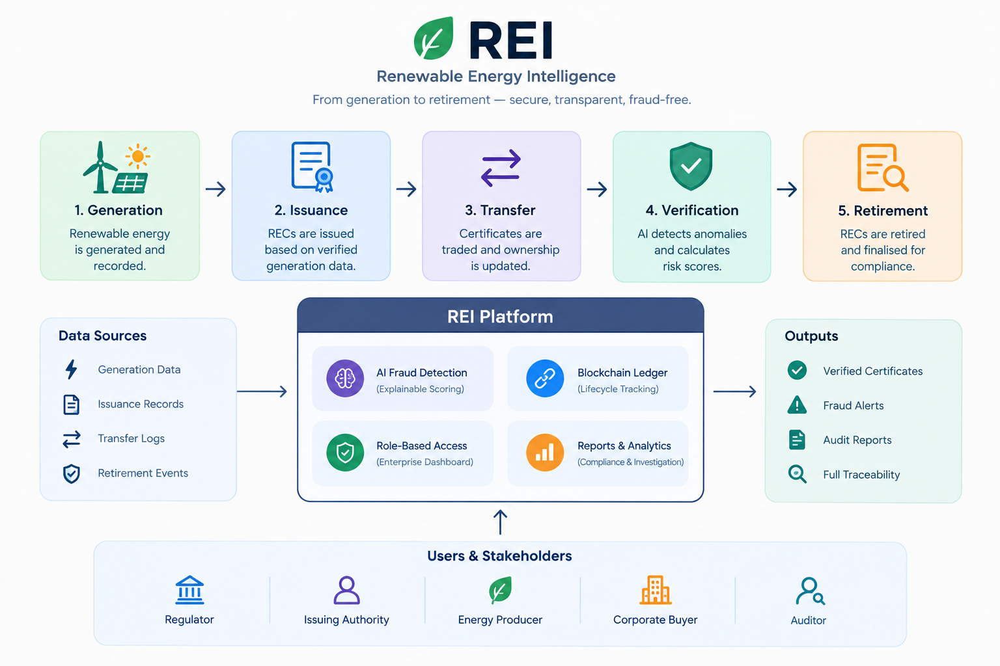

# REI — Renewable Energy Intelligence

A full-stack product prototype for detecting fraud in Renewable Energy Certificates (RECs) using explainable scoring, lifecycle tracking, and role-based oversight.

> Trust every megawatt. Verify every certificate.

## What this project does

This project models a real-world REC registry and compliance platform where renewable generation data, certificate issuance, transfers, and retirement events are monitored for anomalies and fraud.

The application includes:

- A public landing and verification experience
- A role-based enterprise dashboard
- REC lifecycle tracking from generation to retirement
- Explainable fraud scoring for suspicious certificates
- Investigation workflows for regulators and auditors
- Producer and portfolio views for ecosystem participants

## Architecture overview



This architecture captures the full REC lifecycle: generation, issuance, transfer, verification, and retirement, with stakeholder roles and platform outputs connected through the REI system.

## Core features

- Fraud detection across duplicate issuance, mismatch claims, abnormal issuance bursts, and transfer irregularities
- Public certificate traceability and verification workflow
- AI-style risk engine with evidence-backed alerts
- Dashboard views for regulators, issuers, buyers, producers, and auditors
- Synthetic but realistic REC data and ledger-style event history
- Downloadable compliance and investigative reports

## Tech stack

- React 18
- Vite
- Tailwind CSS
- React Router
- Recharts
- lucide-react

## Project structure

```bash
rei-platform/
  src/
    App.jsx
    components/
    data/
    engine/
    pages/
    utils/
  package.json
  README.md
  TESTING.md
```

## Example user roles

- Regulator
- Issuing Authority
- Energy Producer
- Corporate Buyer
- Auditor

Each role has access to a different part of the system, with route-level access controls enforced.

## Quick start

```bash
npm install
npm run dev
```

Then open:

```bash
http://localhost:5173
```

## Why it matters

REC markets depend on trust. If certificate issuance or ownership cannot be verified, green claims become vulnerable to fraud. This project demonstrates an operational model for making those claims auditable, traceable, and transparent.

## Scope note

This is a working prototype and demo environment. The blockchain and ML components are represented in a realistic, product-like way, but the underlying data and system behavior are intentionally simulated for a front-end demonstration.

## Project status

- Frontend prototype complete
- Role-based dashboard and public experience complete
- Risk engine and investigation flows implemented
- Synthetic dataset and demo workflow active

## Related files

- [TESTING.md](TESTING.md) for demo verification steps
- [package.json](package.json) for app scripts and dependencies
